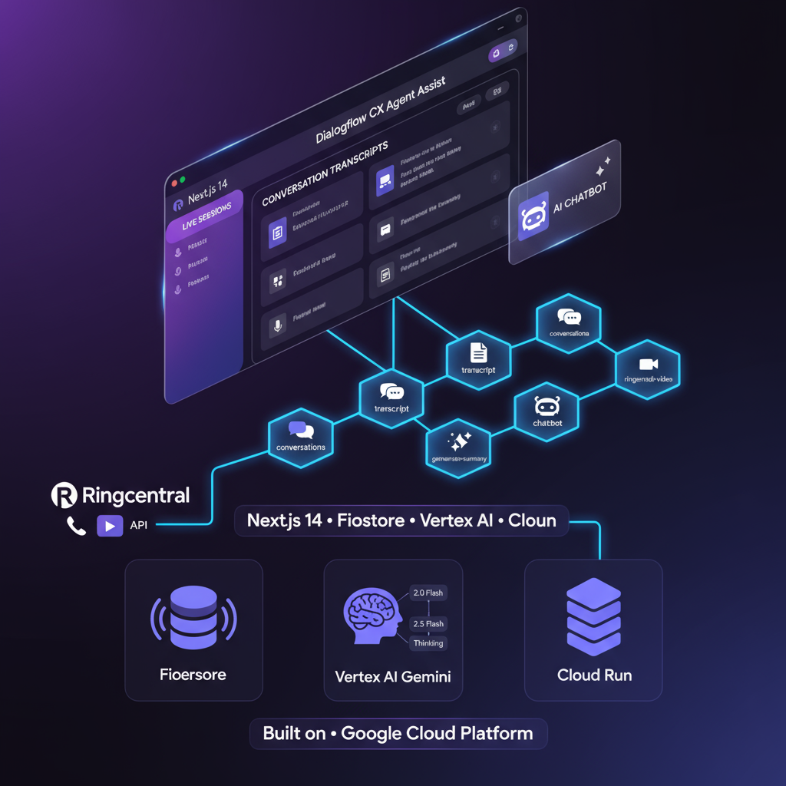

# 🎓 AI Tutor - Educational Platform with Google Cloud AI


> AI-powered educational platform with real-time voice sessions, multi-model Gemini AI, and embedded communications. Built entirely on Google Cloud Platform.

[🚀 Live Demo](https://dialogflow-cx-agent-assist-f5izewubea-uc.a.run.app) | [💖 Support](#support-this-project) | [📚 Documentation](#api-documentation)

---

## ✨ Features

- 🎤 **Live Voice Sessions** - Real-time transcription with Dialogflow CX
- 🤖 **Multi-Model AI** - Gemini 2.0 Flash, 2.5 Flash, Thinking
- 💬 **AI Chatbot Tutor** - Voice-enabled educational assistant (Gami)
- 📞 **Embedded Communications** - Voice & video calls via RingCentral
- 📊 **AI Analytics** - One-click session summaries
- 🔄 **Real-time Sync** - Firestore live database

---

## 🏗️ System Architecture

<div align="center">



*Complete system architecture showing data flow from frontend to Google Cloud services*

</div>

### 🔧 Technical Architecture

Our platform follows a modern serverless architecture pattern, leveraging Google Cloud Platform's managed services for maximum scalability and reliability.

#### **Frontend (Next.js 14)**
- Server-side rendered React application
- Client-side state management with React Hooks
- Real-time UI updates via Firestore listeners
- Responsive design with Tailwind CSS

#### **API Routes (Serverless Functions)**

| Endpoint | Function | Technology |
|----------|----------|------------|
| 🔄 conversations | Session management | Firestore queries |
| 📝 transcript | Parse & format transcripts | String processing |
| 🤖 chatbot | AI tutor responses | Vertex AI Gemini |
| ✨ gemini-summary | Generate summaries | Vertex AI (3 models) |
| 📞 ringcentral-video | Create meetings | RingCentral REST API |
| 🗣️ voice-call | Initiate calls | RingCentral Ring-Out |

#### **Backend Services**

**Google Cloud Firestore**
- Real-time NoSQL database
- Automatic synchronization
- Offline support
- ACID transactions

**Vertex AI (Gemini Models)**
- Gemini 2.0 Flash: Speed-optimized responses
- Gemini 2.5 Flash: Balanced performance
- Gemini Thinking: Deep reasoning capabilities

**Cloud Run**
- Serverless container platform
- Auto-scaling (0 to N instances)
- Pay-per-use pricing
- HTTPS endpoints with custom domains

**RingCentral Platform**
- Voice calling (Ring-Out API)
- Video meetings (Meetings API)
- WebRTC support
- Enterprise-grade quality

#### **Data Flow**
```
┌─────────────────────────────────────────────────────┐
│  User Interaction (Browser/Mobile)                  │
└────────────────────┬────────────────────────────────┘
                     │
                     ▼
┌─────────────────────────────────────────────────────┐
│  Dialogflow CX (Voice Interface)                     │
│  • Speech-to-Text                                    │
│  • Intent Recognition                                │
│  • Session Management                                │
└────────────────────┬────────────────────────────────┘
                     │
                     ▼
┌─────────────────────────────────────────────────────┐
│  Firestore (Data Persistence)                        │
│  • sessionId, audioTranscript, turns[], status      │
└────────────────────┬────────────────────────────────┘
                     │
                     ▼
┌─────────────────────────────────────────────────────┐
│  Next.js Frontend (Real-time Updates)                │
│  • Fetches via /api/conversations                    │
│  • Displays in sidebar + main view                   │
└────────────────────┬────────────────────────────────┘
                     │
        ┌────────────┼────────────┐
        ▼            ▼            ▼
┌─────────────┐ ┌─────────┐ ┌──────────────┐
│ AI Features │ │Analytics│ │Communications│
│ (Vertex AI) │ │(Summary)│ │(RingCentral) │
└─────────────┘ └─────────┘ └──────────────┘
```

### 🚀 Deployment Pipeline
```
Developer Push → GitHub → Cloud Build → Docker Build
                                            ↓
                              Container Registry (GCR)
                                            ↓
                              Cloud Run Deployment
                                            ↓
                              Production (HTTPS endpoint)
```

**Build Time:** ~3 minutes  
**Zero Downtime:** Blue-green deployments  
**Auto-scaling:** 0 to 100+ instances

---

## 🛠️ Tech Stack

**Frontend:** Next.js 14, React 18, Tailwind CSS  
**Backend:** Firestore, Vertex AI, Dialogflow CX, Cloud Run  
**Communications:** RingCentral API  
**DevOps:** Cloud Build, Docker, GitHub

---

## 🚀 Quick Start
```bash
# Clone repository
git clone https://github.com/valarama/ai-tutor.git
cd ai-tutor

# Install dependencies
npm install

# Configure environment
cp .env.local.example .env.local
# Edit .env.local with your credentials

# Run development server
npm run dev

# Open http://localhost:3000
```

---

## 📦 Deployment
```bash
# Deploy to Google Cloud Run
gcloud builds submit --config=cloudbuild.yaml --project=YOUR_PROJECT_ID
```

---

## 💖 Support This Project

If AI Tutor helps you, consider supporting its development!

### 🇮🇳 Support via UPI (India)

<div align="center">


**UPI ID:** `naturelabs@axl`

*Scan with any UPI app: Google Pay • PhonePe • Paytm • BHIM*

</div>

### 🌍 International Support

<div align="center">

[](https://github.com/sponsors/valarama)
[](https://www.buymeacoffee.com/valarama)
[](https://ko-fi.com/valarama)

</div>

---

**Your support helps:**
- 🔧 Fix bugs and maintain code
- ✨ Develop new features
- 📚 Improve documentation
- 🚀 Keep the project alive

---

## 📚 API Documentation

| Endpoint | Method | Description |
|----------|--------|-------------|
| `/api/conversations` | GET | Fetch all sessions from Firestore |
| `/api/transcript?sessionId=X` | GET | Get transcript for specific session |
| `/api/generate-summary` | POST | Generate AI summary using Vertex AI |
| `/api/chatbot` | POST | AI tutor chat responses |
| `/api/ringcentral-call` | POST | Initiate voice call |
| `/api/ringcentral-video` | POST | Create video meeting |

---

## 🎯 Use Cases

- 🎓 **Education** - Virtual tutoring with AI assistance
- 🏢 **Corporate Training** - Employee onboarding and upskilling
- 💼 **Customer Support** - AI-powered agent assistance
- 🌍 **Remote Learning** - One-on-one coaching sessions

---

## 🤝 Contributing

Contributions welcome! Please:
1. Fork the repository
2. Create feature branch: `git checkout -b feature/name`
3. Commit changes: `git commit -m 'Add feature'`
4. Push: `git push origin feature/name`
5. Open Pull Request

---

## 📄 License

MIT License - see [LICENSE](LICENSE) file for details.

---

## 👨‍💻 Author

**Ramamurthy Valavandan**

<div align="center">

[](https://github.com/valarama)
[](https://www.linkedin.com/in/ramavala)
[](https://x.com/ChatGPTJob)

</div>

- 📧 Email: chennaigenai@gmail.com
- 💰 UPI: naturelabs@axl

---

## 🙏 Acknowledgments

- **Google Cloud Platform** for the amazing serverless infrastructure
- **Anthropic** for Claude AI assistance in development
- **RingCentral** for communications API
- **Next.js Team** for the excellent framework
- All contributors and supporters of this project

---

<div align="center">

**Made with ❤️ using Google Cloud Platform**

If this project helps you, please ⭐ star the repository!

[Report Bug](https://github.com/valarama/ai-tutor/issues) · [Request Feature](https://github.com/valarama/ai-tutor/issues) · [💖 Donate](#support-this-project)

</div>